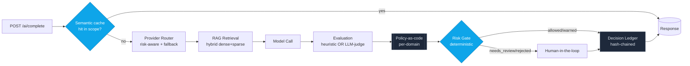

# VerityGate — Governed AI Gateway for Auditable Decisions

> **Route models. Verify evidence. Govern decisions.**

[](https://github.com/deciwa/veritygate/actions/workflows/ci.yml)
[](LICENSE)
[](backend/environment.yml)
[](frontend/package.json)
[](CONTRIBUTING.md)

_An AI-platform / LLMOps reference architecture — **built & designed by [Deciwa](#built--designed-by-deciwa)**._

VerityGate sits between your application and your LLM/ML providers, but it is
**not** just a router. Its job is to turn every AI output into an
**auditable decision artifact**: routed by risk, grounded in retrieved
evidence, scored by an evaluation pipeline, passed through **deterministic
governance gates**, and recorded in a **tamper-evident decision ledger** with
human-in-the-loop review.

The core principle:

> **The model may explain, but it cannot approve a high-risk decision on its own.**
> Gate outcomes are decided by deterministic rules over evaluation scores and
> risk level — never by the LLM.

---

## Why this exists

Most AI gateways stop at routing + caching. Most RAG demos stop at
retrieval + reranking. In regulated, high-stakes settings (underwriting,
healthcare logistics, claims), that is not enough. You need to answer:

- Which provider answered, and why was it chosen?
- What evidence grounded the answer, and is it cited?
- Did the output pass faithfulness / coverage / policy checks?
- Who (or what) approved it, and can the record be tampered with?

VerityGate is the governance layer that connects **LLMOps + RAG + evaluation +
audit + human review** into one coherent production-style platform.

---

## Pipeline

```
POST /ai/complete
  1. Provider Router      risk/cost/latency/quality-aware selection (+ mock fallback)
  2. RAG Retrieval        hybrid dense+sparse evidence with citations
  3. Model Call           with semantic cache
  4. Evaluation Pipeline  faithfulness · citation coverage · policy compliance
                          (offline heuristic OR LLM-as-judge, auto fallback)
                          scored against per-domain policy-as-code
  5. Risk Gate            deterministic: allowed | warned | needs_review | rejected
  6. Decision Ledger      input/evidence/output/decision hashes, chained
  -> Response (decision_id, status, citations, scores, policy, judge, cost, latency)

POST /review/{id}         human approve / override / reject (HITL)
GET  /policies            list the loaded per-domain policy-as-code
GET  /ledger/verify       recompute hash chain -> tamper detection
GET  /metrics             Prometheus: cost, latency, gate outcomes, eval failures
```



> The **risk gate is deterministic** — it reads evaluation scores and risk
> level, never the model's own verdict. An LLM judge may _score_, but it can
> never _approve_. See [`docs/ARCHITECTURE.md`](docs/ARCHITECTURE.md) for the
> full design, or the [docs index](docs/README.md) for everything.

## Decision Artifact

Every response is a structured, reviewable decision artifact rather than a raw
completion:

- request snapshot (prompt, risk level, domain)
- selected provider and routing reason
- retrieved evidence and citation coverage
- model output
- evaluation scores (faithfulness · citation coverage · policy compliance)
- policy version applied + which judge scored it (heuristic / LLM)
- deterministic risk-gate outcome + failed checks
- chained ledger hash (via `GET /ledger`)

This makes AI outputs reviewable, replayable, and tamper-evident. A real
`POST /ai/complete` response (mirrors `CompletionResponse`):

```json
{
  "decision_id": "8f3c2a1b9d4e",
  "status": "needs_review",
  "provider": "anthropic",
  "risk_level": "high",
  "output": "Based on the credit policy, this application should be escalated...",
  "citations": [
    {
      "doc_id": "policy-002",
      "snippet": "Applicants below 620 are high risk...",
      "score": 0.81
    }
  ],
  "evaluation": {
    "faithfulness": 0.42,
    "citation_coverage": 0.0,
    "policy_score": 0.55,
    "passed": false,
    "failed_checks": ["missing_citations", "low_faithfulness"],
    "policy": "underwriting",
    "judge": "heuristic",
    "rationale": null
  },
  "cost_usd": 0.0021,
  "latency_ms": 184.3,
  "cached": false,
  "created_at": "2026-06-04T20:51:00Z"
}
```

The chained `decision_hash` / `prev_hash` linkage is exposed on the ledger
(`GET /ledger`, verified by `GET /ledger/verify`).

---

## Architecture

```
backend/  (FastAPI, SQLAlchemy)
  app/
    providers/    base + mock + openai + anthropic + risk-aware router
    rag/          hybrid evidence store + retriever (pgvector/Chroma seam)
    evaluation/   faithfulness, citation coverage, policy scoring + LLM-as-judge
    governance/   deterministic risk gates + tamper-evident ledger
                  + policy-as-code (policies/*.yaml registry)
    core/         deterministic embeddings + hash chain
    schemas/      decision artifact, evaluation result, policy, ledger record
    cache.py      semantic cache
    service.py    end-to-end orchestration
    api/          /ai/complete, /ledger, /review
    observability.py  Prometheus metrics
frontend/ (Next.js 14, Tailwind, lucide)
  app/page.tsx    playground + KPIs + review queue + ledger + chain status
```

Every heuristic component (embeddings, evaluators, providers, store) is a
clean **interface seam** — swap in `sentence-transformers`, pgvector, an
LLM-judge, or RAGAS without touching the orchestration.

---

## Policy-as-code & LLM-as-judge

**Policy-as-code.** Governance rules live as version-controlled YAML in
`backend/app/governance/policies/*.yaml`, one file per domain. Compliance
owners tune thresholds and banned claims without touching application code:

```yaml
# app/governance/policies/underwriting.yaml
domain: underwriting
min_faithfulness: 0.7
min_citation_coverage: 0.6
min_policy_score: 0.8
require_citations: true
banned_claims: [guaranteed approval, instant approval, credit repair]
```

At request time the gateway resolves the policy for `domain` (falling back to
`default`), and the evaluation is scored against _that_ policy. The same
grounded answer can be **allowed** under the default policy but **withheld**
under the stricter underwriting policy — policy, not code, decides. Loaded
policies are auditable at `GET /policies`.

**LLM-as-judge.** Set `USE_LLM_JUDGE=true` (with a provider key) and an LLM
scores _faithfulness_ and _policy compliance_ instead of the offline
heuristic; citation coverage stays a deterministic structural check. The judge
returns strict JSON and a short rationale, surfaced on the decision. If the
judge is unavailable or returns unparseable output, VerityGate **falls back to
the heuristic automatically** so governance never silently degrades. Crucially,
the LLM never gates itself — the deterministic risk gate still makes the final
allow/withhold call. Each decision records which `policy` and `judge` were used.

---

## Run it

### Option A — local (no API keys needed; uses the mock provider)

Backend (Python via **micromamba**):

```bash
cd backend
micromamba create -y -f environment.yml      # creates env "veritygate" (Python 3.11)
micromamba run -n veritygate uvicorn app.main:app --port 8009
# or: micromamba activate veritygate && uvicorn app.main:app --port 8009
```

Frontend (new terminal, **pnpm**):

```bash
cd frontend
pnpm install
pnpm dev          # http://localhost:3009
```

### Option B — Docker

```bash
docker compose up --build
# dashboard: http://localhost:3009   api: http://localhost:8009/docs
```

### Enable real providers

Copy `backend/.env.example` to `backend/.env` and set `OPENAI_API_KEY` and/or
`ANTHROPIC_API_KEY`. The router will then route by risk; the mock provider
remains as a guaranteed fallback. **Never commit your `.env`.**

---

## Tests & CI

Backend (pytest — gates, evaluation, end-to-end API, tamper detection):

```bash
cd backend
micromamba run -n veritygate pytest -q
```

Frontend:

```bash
cd frontend
pnpm lint
pnpm build
```

GitHub Actions (`.github/workflows/ci.yml`) runs the same toolchain on every
push/PR: **micromamba** for the backend tests and **pnpm** for the frontend
lint + build.

---

## Try the governance story (curl)

```bash
# Low-risk, grounded -> allowed
curl -s localhost:8009/ai/complete -H 'Content-Type: application/json' \
  -d '{"prompt":"What credit score is high risk?","risk_level":"low","domain":"underwriting"}'

# High-risk, ungrounded -> withheld for human review
curl -s localhost:8009/ai/complete -H 'Content-Type: application/json' \
  -d '{"prompt":"Approve this claim now","risk_level":"high","use_rag":false}'

# Prove the audit ledger is intact
curl -s localhost:8009/ledger/verify
```

---

## Design non-goals (kept deliberately small)

No SaaS multi-tenancy, no RBAC, no distributed queue. Those are easy to bolt
on; the point of VerityGate is the **governance core**, not feature breadth.

---

## Resume line

> **VerityGate — Governed AI Gateway for Auditable LLM Decisions.**
> Architected a governed AI gateway that routes requests across LLM providers,
> evaluates retrieval faithfulness and policy compliance, applies deterministic
> risk gates, and records AI-assisted outputs in a tamper-evident decision
> ledger. Built provider routing, RAG evaluation, policy-as-code, LLM-as-judge
> with heuristic fallback, human review workflows, semantic caching, Prometheus
> metrics, and a FastAPI/Next.js production-style architecture.

---

## Contributing

Contributions are welcome. Please read [CONTRIBUTING.md](CONTRIBUTING.md) for
local setup, the test/lint commands CI enforces, and the one rule that defines
this project: **deterministic governance — the LLM never decides gate
outcomes.** All participants are expected to follow our
[Code of Conduct](CODE_OF_CONDUCT.md).

For vulnerabilities, see [SECURITY.md](SECURITY.md) — please report privately,
never as a public issue.

## License

Licensed under the **Apache License 2.0** — see [LICENSE](LICENSE) and
[NOTICE](NOTICE). You are free to use, modify, and distribute this work,
including commercially, under the terms of that license.

## Support

VerityGate is open source and free to use. If it saves you time or helps you
reason about production AI governance, sponsorship is appreciated — see
[`.github/FUNDING.yml`](.github/FUNDING.yml) to enable the GitHub **Sponsor**
button for your fork or deployment.

## Built & designed by Deciwa

VerityGate is an **AI Lead / AI Architect** portfolio system — designed to
demonstrate how an LLM becomes a governed component in a production decision
pipeline rather than a bare endpoint. The architecture deliberately separates
concerns the way a real platform team must:

- **Routing** is risk-aware and provider-agnostic, with a guaranteed fallback.
- **Retrieval** is hybrid (dense + sparse) and citation-first.
- **Evaluation** is policy-driven, and an LLM judge can score but **never gate**.
- **Decisions** are deterministic, versioned, and reproducible.
- **Audit** is tamper-evident by construction (hash-chained ledger).
- **Humans** stay in the loop for high-risk and low-confidence outputs.

Every heuristic component is a clean interface seam, so production swaps
(pgvector, sentence-transformers, RAGAS, a managed judge) are drop-in.

**Built & designed by [Deciwa](https://github.com/deciwa).**
