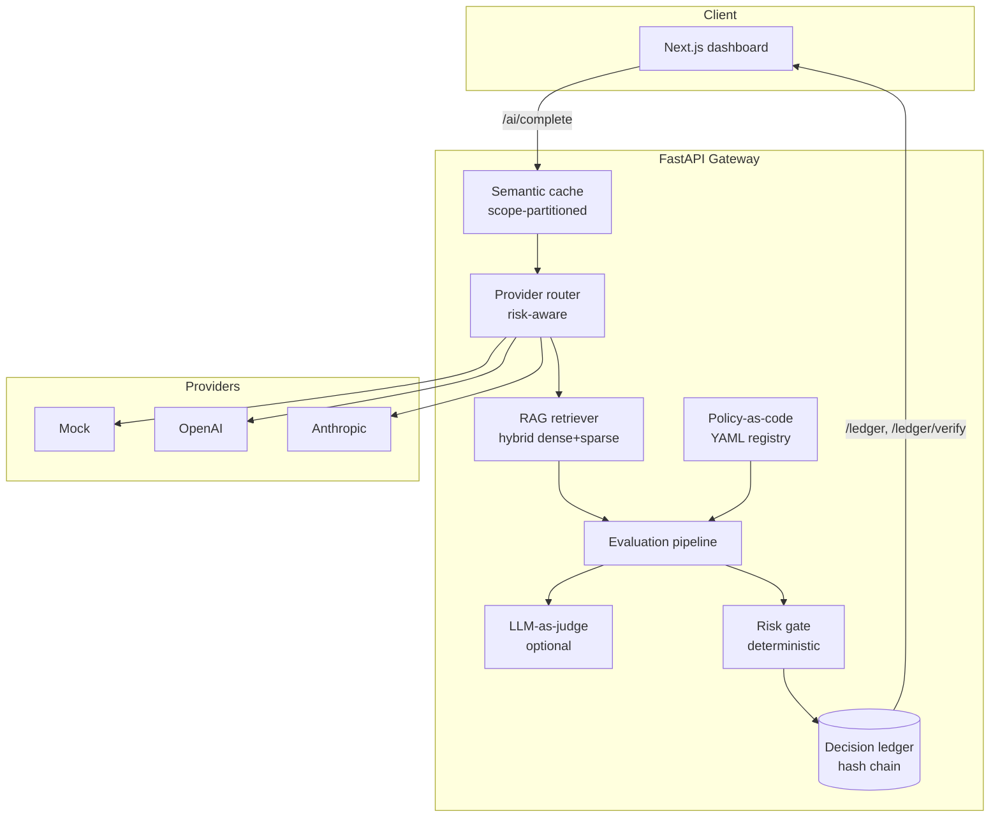

# VerityGate Architecture

> Built & designed by **Deciwa**.

This document explains _why_ VerityGate is structured the way it is. The guiding
idea is simple and load-bearing:

> **An LLM is a component in a governed decision pipeline, not the decision
> maker.** The model may explain and even score, but a deterministic gate —
> not the model — decides whether a high-risk output is approved.

## System overview



## Components

### 1. Provider router (`app/providers/`)

Selects a provider by strategy (`risk` | `cost` | `latency` | `quality`) and
the request's risk level. A deterministic, dependency-free **mock provider**
is always registered as a fallback, so the system runs and tests without any
API keys. Real providers (`openai`, `anthropic`) activate only when their keys
are present. `BaseProvider` is the seam — adding a provider is one class.

### 2. RAG retrieval (`app/rag/`)

`EvidenceStore.search` computes a **hybrid score**:

```
score = alpha * cosine(dense) + (1 - alpha) * keyword_overlap(sparse)
```

with optional per-domain metadata filtering. The retriever turns ranked
documents into `Citation`s and a context string. The store interface is where
pgvector/Chroma would plug in unchanged; embeddings are deterministic and
hashing-based so there are no external calls in the default build.

### 3. Semantic cache (`app/cache.py`)

An embedding-similarity cache (cosine ≥ threshold), **partitioned by a
governance scope** built from `domain | risk_level | use_rag | provider`. This
prevents a governance leak: a cached answer generated under one policy can
never be served for a different policy, even for an identical prompt. Only
clean, auto-`allowed` responses are cached.

### 4. Evaluation (`app/evaluation/`)

Produces three scores in `[0,1]`: **faithfulness**, **citation coverage**, and
**policy compliance**, plus a list of failed checks. Two modes:

- **Heuristic (default):** offline, deterministic, no external calls.
- **LLM-as-judge (opt-in):** an LLM scores faithfulness and policy compliance;
  citation coverage stays a deterministic structural check. On any failure
  (no provider, network error, unparseable output) it **falls back to the
  heuristic automatically**, so governance never silently degrades.

Crucially, the judge only _scores_. It never decides the gate outcome.

### 5. Policy-as-code (`app/governance/policies/*.yaml`)

Per-domain thresholds and banned claims live in version-controlled YAML, loaded
into a registry and resolved per request (falling back to `default`). The same
grounded answer can be `allowed` under one policy and withheld under a stricter
one — **policy, not code, decides**. Loaded policies are auditable at
`GET /policies`.

### 6. Risk gate (`app/governance/risk.py`)

A pure function of evaluation scores + risk level → one of `allowed`,
`warned`, `needs_review`, `rejected`. Deterministic and reproducible: same
inputs always yield the same gate decision. This is the heart of the
governance guarantee.

### 7. Decision ledger (`app/governance/ledger.py`)

Every decision is recorded as a hash-chained entry. `decision_hash` links to
the previous entry, so any post-hoc edit to content or ordering is detectable.
`verify_chain` recomputes artifact hashes from the raw stored fields (catching
content edits) and re-validates the chain linkage (catching reordering or hash
tampering). The immutable `gate_status` is hashed; human-review fields are
mutable metadata layered on top.

### 8. Human-in-the-loop (`app/api/review.py`)

`needs_review` decisions enter a queue. A reviewer can **approve**, **override**
(with a corrected output), or **reject**, with an optional note. The original
deterministic `gate_status` remains in the hash chain; the review is recorded
as additional, attributable metadata.

## Request lifecycle

1. Build the cache scope; return a cached artifact on an in-scope hit.
2. Route to a provider based on strategy + risk.
3. Retrieve hybrid evidence and citations (unless `use_rag=false`).
4. Call the model (real or mock).
5. Evaluate against the resolved per-domain policy (heuristic or LLM judge).
6. Apply the deterministic risk gate.
7. Record the decision in the tamper-evident ledger.
8. Cache only clean `allowed` responses, scoped to their governance context.

## Design principles

- **Determinism at the gate.** Reproducibility and auditability beat cleverness.
- **Interface seams everywhere.** Embeddings, store, providers, and judge are
  swap-in points for production-grade implementations.
- **Fail safe, not silent.** When the judge is unavailable, fall back; never
  degrade governance without a trace.
- **Small on purpose.** No multi-tenancy, RBAC, or queues — the value is the
  governance core, not feature breadth.

---

Built & designed by **Deciwa**.
